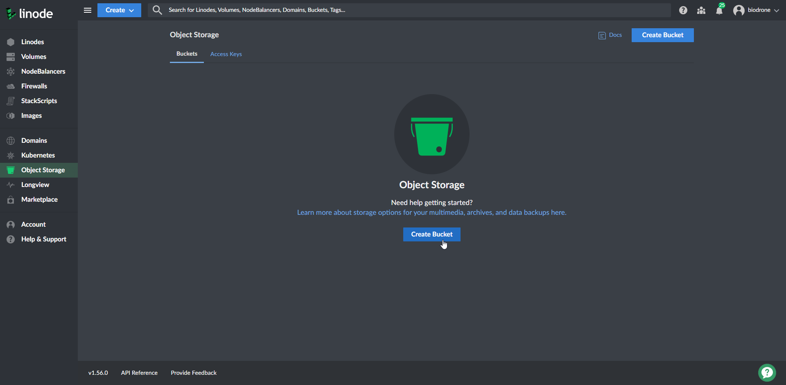
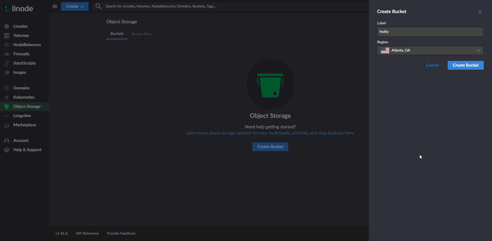
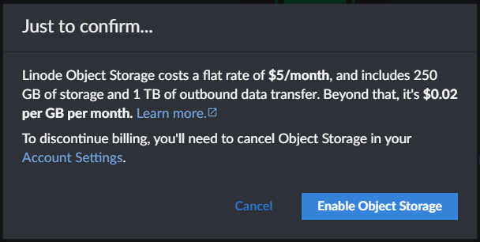
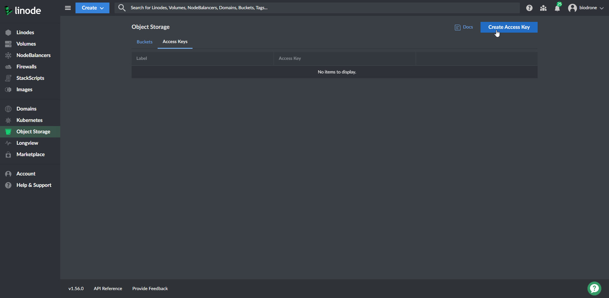
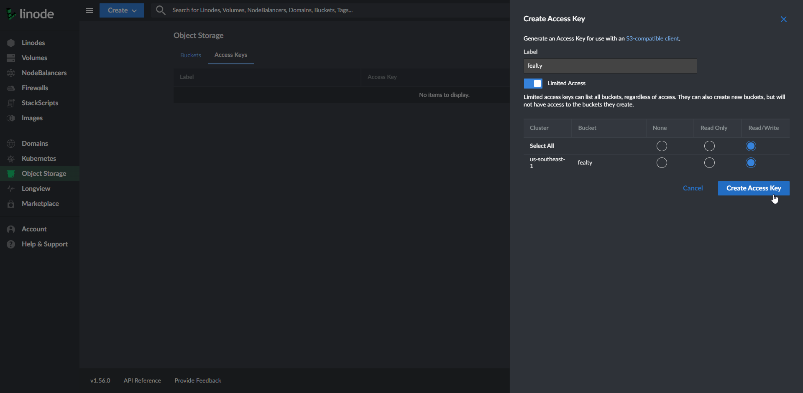
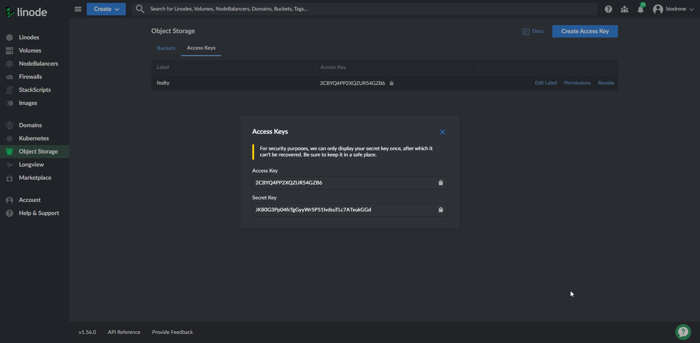

# FealTY

FealTY - An open source and easy to deploy customer rewards scheme.

## Setup

### Prerequisites

- Linode Account ([Sign Up Here](https://login.linode.com/signup))
- GitHub Account ([Sign Up Here](https://github.com/join))
- A registered domain with Nameservers pointed to Linode (optional) ([Walkthrough Here](https://www.linode.com/docs/guides/dns-manager/))

Once you have accounts to both of these services, this README will walk you through setting up everything else!

### Linode API Key

Follow this [Linode Tutorial](https://www.linode.com/docs/guides/getting-started-with-the-linode-api/#get-an-access-token) to obtain an API Key.

When selecting the scope, 'Select All' for Read/Write will work fine, if you want more granular options, the services that we _need_ are:

- Domains
- Images
- Linodes
- Object Storage
- Volumes

Make sure these have Read/Write permissions and you'll be golden.

### Linode Object Storage

In order for our infrastructure to be deployed from 'the cloud' we need to create a Linode Object Storage bucket to hold the current status of our servers.

#### Create The Bucket

- Navigate to the 'Object Storage' tab of your Linode Dashboard and click 'Create Bucket'

- Give your bucket a label (I'd suggest something related to the task such as fealty/rewards) and a region (I'd suggest Atlanta because that's where our servers will be (currently because of Linode VLAN offering) but it doesn't really matter)

- Agree to the warning about a $5 a month charge, you won't exceed any bandwidth caps and you can use these buckets to replace things like Dropbox/Google Drive, if you're looking for extra monetary value

#### Create an Access Key

- From within the 'Object Storage' tab, select 'Access Keys' and click 'Create Access Key'

- Give your key a label (again, I'd suggest fealty/rewards), switch on 'Limited Access' and make sure to select the bucket you just created for read/write access (this will look like you're selecting all for now but if you create other buckets this key won't have access, best practise really 🤷‍♂️)

- When the Access Key and Secret pop up, __COPY THESE SOMEWHERE__ (a notepad document will do for now but if you have a password manager that's preferrable)

## Dev Info - API Routes

### Accounts

- [ ] Update (Partial) - **STRETCH**
