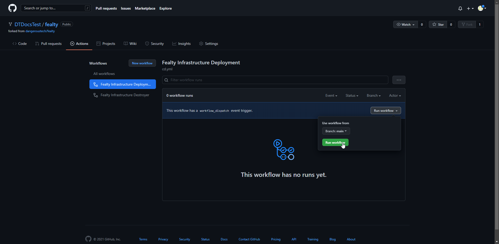
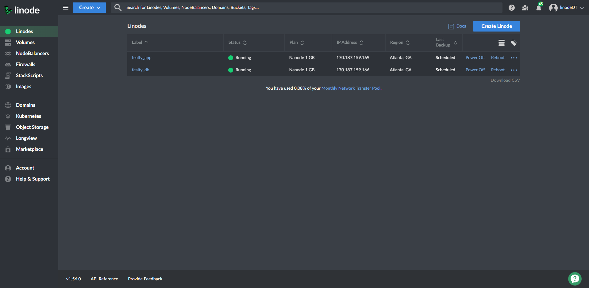
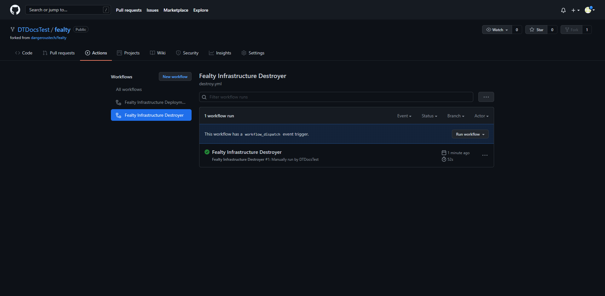

<!-- markdownlint-disable MD024 -->
# FealTY

FealTY - An open source and easy to deploy customer rewards scheme.

Follow the below instructions to get this all set up! (Please report any issues [here](https://github.com/dangeroustech/fealty/issues))

## Outcomes

Once setup is complete, this will create the following infrastructure for you:

- A database server to hold the records of customers reward points (Linode don't have managed DBs yet)
- An app server to accept API requests, interrogate the Database, and provide basic frontend rendering for web browsers
- A Linode Domain with an A record at rewards.domain.xyz pointing at the app server

## Prerequisites

- Linode Account ([Sign Up Here](https://login.linode.com/signup))
- GitHub Account ([Sign Up Here](https://github.com/join))
- A registered domain with Nameservers pointed to Linode (optional) ([Walkthrough Here](https://www.linode.com/docs/guides/dns-manager/))

Once you have accounts to both of these services, this README will walk you through setting up everything else!

## Linode API Key

Follow this [Linode Tutorial](https://www.linode.com/docs/guides/getting-started-with-the-linode-api/#get-an-access-token) to obtain an API Key.

When selecting the scope, 'Select All' for Read/Write will work fine, if you want more granular options, the services that we _need_ are:

- Domains
- Images
- Linodes
- Object Storage
- Volumes

Make sure these have Read/Write permissions and you'll be golden.

## Linode Object Storage

In order for our infrastructure to be deployed from 'the cloud' we need to create a Linode Object Storage bucket to hold the current status of our servers

### Create The Bucket

- Navigate to the 'Object Storage' tab of your Linode Dashboard and click 'Create Bucket'


- Give your bucket a label (this needs to be fealty for some other purposes down the line) and a region (Newark, NJ is the default so leave it at that)


- Agree to the warning about a $5 a month charge, you won't exceed any bandwidth caps and you can use these buckets to replace things like Dropbox/Google Drive, if you're looking for extra monetary value


### Create an Access Key

- From within the 'Object Storage' tab, select 'Access Keys' and click 'Create Access Key'


- Give your key a label (again, I'd suggest fealty), switch on 'Limited Access' and make sure to select the bucket you just created for read/write access (this will look like you're selecting all for now but if you create other buckets this key won't have access, best practise really 🤷‍♂️)


- When the Access Key and Secret pop up, __COPY THESE SOMEWHERE__ (a notepad document will do for now but if you have a password manager that's preferrable)


## GitHub Bits

### Fork The Repo

- When on the main GitHub repository page, press the 'Fork' button in the top-right corner


- Wait for the forking screen to disappear


- You will now notice the repository again, except under your username in the top left corner


### Add Keys

- Click on the 'Settings' tab from the main repository view


- Navigate to 'Secrets' on the left sidebar


- Use the 'New repository secret' button to add the following secrets:

  - LINODE_TOKEN - The API token you generated in the first Linode step
  - OBJECT_ACCESS_KEY - The Access Key from the Linode Object Storage step
  - OBJECT_SECRET_KEY - The Secret Key from the Linode Object Storage step
  - DOMAIN - Your domain (you don't even have to own it, it just needs to be unique to Linode, but if you don't own it then it won't _actually_ resolve, ofc)
  - FEALTY_USER - Admin interface username
  - FEALTY_PASS - Admin interface password


### Deploy

- Select the 'Actions' tab from the main repository page


- Click the green button to allow workflows


- Select the action 'Fealty Infrastructure Deployment' from the list, click the 'Run workflow', leave the Branch on 'main' and click the green 'Run workflow' button



- In a few seconds you will see a workflow item appear, this will take around 10 minutes to generate images and create the necessary infrastructure


- Feel free to drill down in to the logs and see what's happening, alternatively you'll know it's over when your Linode account has these two Linodes running



- When the run is finished, you'll get a nice little green checkmark next to the workflow


- After this, head to "https://rewards.$YourDomainHere/api/v1/accounts/admin" and log in with the username and password you set in the secrets tab earlier. If you forget these, just change the secret and deploy the workflow again!

- One last step to ensure that the SSL certificate stays valid on the admin interface, just go to the workflow marked 'Cert Renewal' and click 'Enable workflow' in the top right


### Destroy

- Head to the Actions tab again and select the 'Fealty Infrastructure Destroyer' workflow


- As long as the keys are all still valid, the workflow will destroy all of the infrastructure in Linode
_Caveat: won't remove the Object Storage bucket, do that manually_



## Dev Info - API Routes

> All endpoints are protected by Bearer authentication besides the healthcheck

---

### /healthz

**Type**: GET

**Info**: Healthcheck endpoint

**Returns**: HTTP 200

---

### /api/v1/accounts/admin

**Type**: GET

**Info**: Admin UI for administering accounts

**Returns**: Rendered HTTP interface (requests Bearer auth from browser if necessary)

---

### /api/v1/accounts/get

**Type**: GET

**Info**: Gets all account info at once back as JSON

**Returns**: JSON list of accounts, example:

```JSON
{
    "accounts": {
        "account": {
            "accountid": "ObjectID(1234567890)",
            "rewardpoints": 45,
            "email": "test@test.com",
            "marketing": false,
        },
        "account": {
            "accountid": "ObjectID(0987654321)",
            "rewardpoints": 54,
            "email": "test2@test.com",
            "marketing": true,
        },
    }
}
```

---

### /api/v1/account

**Type**: GET

**Info**: Gets a single account's details. Requires:

```JSON
{
    "email": "test@test.com"
}
```

**Returns**: Account information. Example:

```JSON
{
    "account": {
        "accountid": "ObjectID(1234567890)",
        "rewardpoints": 45,
        "email": "test@test.com",
        "marketing": false,
    }
}
```

**Returns**: Alternatively, an error:

```JSON
{
    "Error": "Account For test@test.com Not Found"
}
```

---

### /api/v1/account

**Type**: POST

**Info**: Create a new account. Requires:

```JSON
{
    "email": "test@test.com",
    "rewardpoints": 123,
    "marketing": false,
}
```

**Returns**: Newly created account information. Example:

```JSON
{
    "account": {
        "accountid": "ObjectID(1234567890)",
        "rewardpoints": 123,
        "email": "test@test.com",
        "marketing": false,
    }
}
```

**Returns**: Alternatively, an error:

```JSON
{
    "Error": "Account for This Email Already Exists"
}
```

---

### /api/v1/account

**Type**: PUT

**Info**: Update current account. Partial update possible.
Only provided data will be changed. Requires:

```JSON
{
    "email": "test@test.com",
    "rewardpoints": 123,
    "marketing": false,
}
```

**Returns**: Updated account information. Example:

```JSON
{
    "account": {
        "accountid": "ObjectID(1234567890)",
        "rewardpoints": 123,
        "email": "test@test.com",
        "marketing": false,
    }
}
```

**Returns**: Alternatively, an error:

```JSON
{
    "Error": "Account Not Found"
}
```

---

### /api/v1/account

**Type**: DELETE

**Info**: Delete account. Requires:

```JSON
{
    "email": "test@test.com"
}
```

**Returns**: Full account info for the deleted account. Example:

```JSON
{
    "account": {
        "accountid": "ObjectID(1234567890)",
        "rewardpoints": 123,
        "email": "test@test.com",
        "marketing": false,
    }
}
```

**Returns**: Alternatively, an error:

```JSON
{
    "Error": "Account Not Found"
}
```

---
